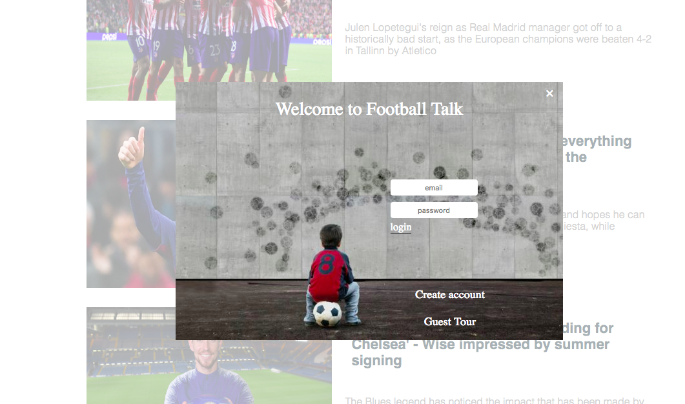

# `Football-Talk`

[Live Demo](https://football-talk.herokuapp.com/#/)

Football-Talk is a full-stack, single-page application built using React.js/Redux on the frontend and Rails/PostgreSQL on the backend. Football-Talk is a website that shares stories form the world of football(soccer) and is inspired by the story-sharing platform 'Medium'.

## `Technologies`

The project is implemented with the following technologies:

* `Ruby on Rails` for generating migrations, creating models with validations, associations and methods, controllers for proper * routing and rendering of views
* `PostgreSQL` for database management
* `JSON/JBuilder` for rendering JSON objects out of ruby instances to be sent to the frontend
* `JQuery` for making AJAX calls to fetch information from the backend
* `JavaScript ES6` for enhancing components
* `React.js` for updating and rendering proper components
* `Redux` for maintaining predictable state
* `Webpack` to bundle js files
* `Amazon Web Services` for remote storage
* `HTML5` for formatting
* `CSS3` for styling components

## `Login / Sign up`

Football-Talk has a secure frontend to backend user authentication using BCrypt. Through the use of protected routes, Football-Talk reveals a login/signup modal whenever an unauthorized user attempts to use the site. Also, the website provides a guest login option.

## `Homepage`

Homepage shows the latest stories written by users. Separate react components are used for rendering.

## `Create a story`

Users can write their own stories and attach a image related to the story.

## `Show a story`

Logged in users can read stories from other authors/users.

## `Future Features`

* Comment on story
* Clap on a story
* Follow other authors/users
* Ability to search stories and users through PG Search
* Popular stories and recommended stories as part of the homepage
* User profile page with all the stories created by him/her
* User can update/delete his/her own information, stories and comments
* Categories/Tags
* Loading screen
* Mobile Friendly
